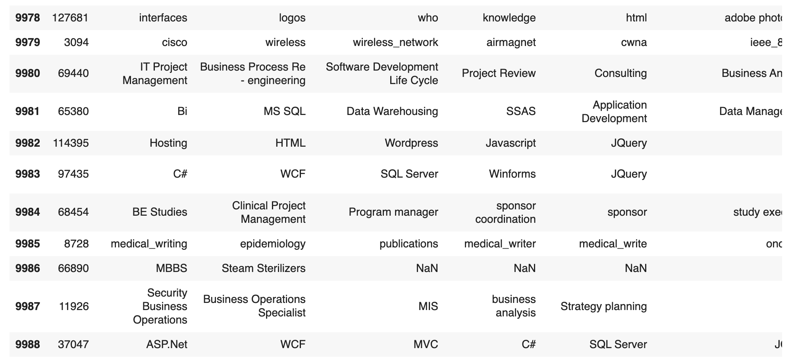

# Skill2vec Dataset
Dataset and pre-trained model for Skill2vec

The skill dataset is collected and processed from a large number of job descriptions, using a number of parsers and conducting preprocessing to standardize.

This dataset is used to experiment with the paper: [Skill2vec: Machine Learning Approach for Determining the Relevant Skills from Job Description](https://arxiv.org/abs/1707.09751)

Please cite the article if you use this dataset

```
@article{van2017skill2vec,
  title={Skill2vec: Machine Learning Approach for Determining the Relevant Skills from Job Description},
  author={Van-Duyet, Le and Quan, Vo Minh and An, Dang Quang},
  journal={arXiv preprint arXiv:1707.09751},
  year={2017}
}
```

# Format



```
16317,ASP.Net,Entity Framework,MVC,.Net,SQL,Web Technologies,Analytical Skills,Problem Solving,Communication Skills
125891,ICWA,Accounting Packages,Mba Finance,Ca,Bcom,Tally
93576,Strong Communication Skills,SEO Head,Digital Marketing Head,Digital Marketing,SEO,PPC,E - commerce
45952,General Management,Food,Sales,Marketing Strategy,Operations
9198,project,resource,engagement
14739,AngularJS Developer,AngularJS,Java development,Java Script
127492,Investment,hni,investments,investment advisor,Investors Relation Management,Wealth Management,mutual funds,portfolio management,priority banking,preferred banking,Equity Sales,relationship manager,broking sales,financial sales
8540,start_up,google_up,amazon,sap,microsof,vmware,test,tests,tested,testing,qa,quality_assurance,framework,frameworks,tools,tool,java,j2ee,jee,j2me,javase,javaee,javame,j2seb,c++,c,webdriver,selenium,appium,android,ios,selendroid,mobile,web_driver
59999,tiles,java j2ee,oracle,struts,ejb,jboss,jdbc,product development,computer science,business solutions
```

# Download 

- Skills from 1K JD: [skill2vec_1K.csv](skill2vec_1K.csv)
- Skills from 10K JD: [skill2vec_10K.csv](skill2vec_10K.csv)
- Skills from 50K JD: [skill2vec_50K.csv.gz](skill2vec_50K.csv.gz)
- Full 130K JD: *please contact*

# Related project

- related-skills-visualization: https://github.com/duyetdev/related-skills-visualization
- skill2vec: https://github.com/duyetdev/skill2vec
- https://duyetdev.github.io/related-skills-visualization/network-skills.html

# License

MIT License

Copyright (c) 2019 Van-Duyet Le

Permission is hereby granted, free of charge, to any person obtaining a copy
of this software and associated documentation files (the "Software"), to deal
in the Software without restriction, including without limitation the rights
to use, copy, modify, merge, publish, distribute, sublicense, and/or sell
copies of the Software, and to permit persons to whom the Software is
furnished to do so, subject to the following conditions:

The above copyright notice and this permission notice shall be included in all
copies or substantial portions of the Software.

THE SOFTWARE IS PROVIDED "AS IS", WITHOUT WARRANTY OF ANY KIND, EXPRESS OR
IMPLIED, INCLUDING BUT NOT LIMITED TO THE WARRANTIES OF MERCHANTABILITY,
FITNESS FOR A PARTICULAR PURPOSE AND NONINFRINGEMENT. IN NO EVENT SHALL THE
AUTHORS OR COPYRIGHT HOLDERS BE LIABLE FOR ANY CLAIM, DAMAGES OR OTHER
LIABILITY, WHETHER IN AN ACTION OF CONTRACT, TORT OR OTHERWISE, ARISING FROM,
OUT OF OR IN CONNECTION WITH THE SOFTWARE OR THE USE OR OTHER DEALINGS IN THE
SOFTWARE.
